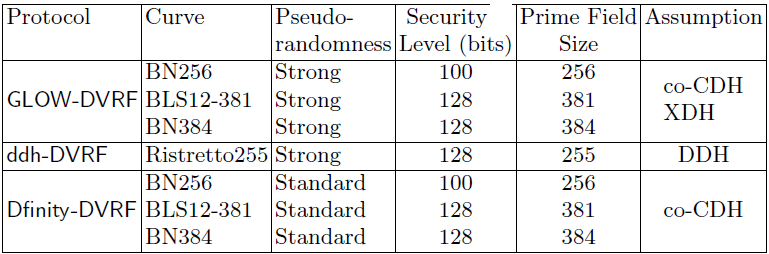
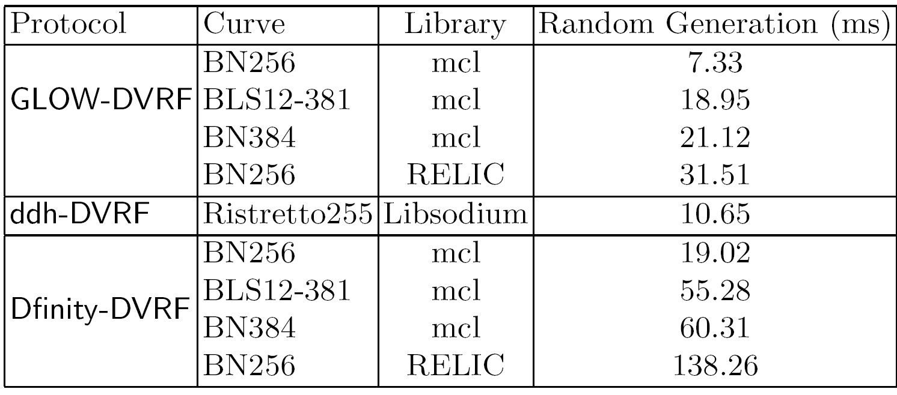
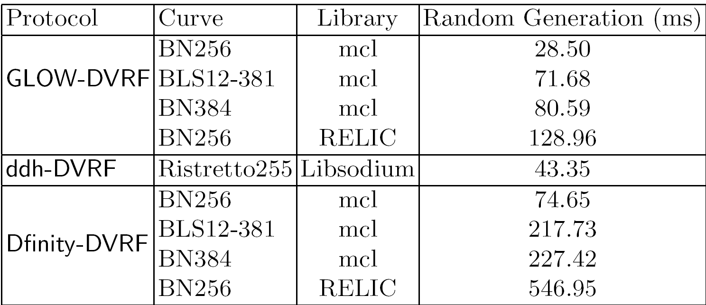
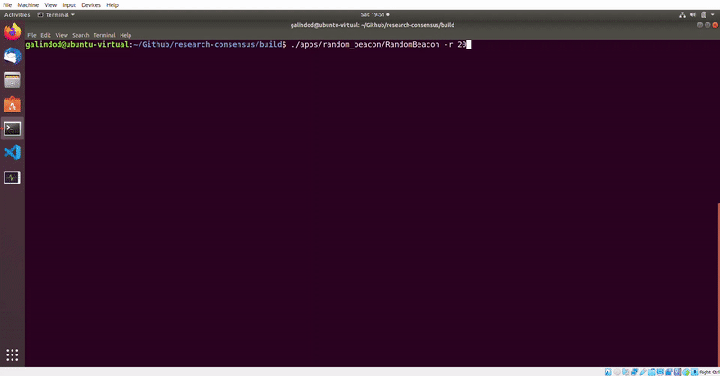

# Distributed Verifiable Random Functions: an Enabler of Decentralized Random Beacons

This code repository provides  __a C++ implementation of three Distributed Verifiable Random Functions__  (DVRF) described in Fetch.AI's technical report [Fully Distributed Verifiable Random Functions and their Application to Decentralised Random Beacons](dvrfs-report.pdf) and named respectively GLOW-DVRF, DDH-DVRF and Dfinity-DVRF. A _Distributed Verifiable Random Function_ is a particular case of [secure multiparty computation](https://en.wikipedia.org/wiki/Secure_multi-party_computation) that allows a set of mutually distrustful servers to initialize and compute a [Verifiable Random Function](https://tools.ietf.org/html/draft-irtf-cfrg-vrf-05) *f<sub>sk</sub>(x)* for strings *x*, with no trusted central party. A Verifiable Random Function  can be seen as the public-key cryptography version of a keyed cryptographic hash. A prominent application for such protocols is in PoS-based consensus in distributed ledgers which require a reliable, unpredictable and unbiased source of entropy or [Decentralized](https://blog.cloudflare.com/league-of-entropy/) [Random Beacon](https://csrc.nist.gov/projects/interoperable-randomness-beacons) (DRB) to select block producers.

#### Disclaimer :heavy_exclamation_mark:

Fetch.AI makes no representation or guarantee that this software (including any third-party libraries)
will perform as intended or will be free of errors, bugs or faulty code. The software may fail which
could completely or partially limit functionality or compromise computer systems. If you use or
implement this library, you do so at your own risk. In no event will Fetch.AI be liable to any party
for any damages whatsoever, even if it had been advised of the possibility of damage.

As such this codebase should be treated as experimental and does not contain all currently developed
features. 

This code is licensed under the Apache software license (see LICENSE file). Unless required by
applicable law or agreed to in writing, software distributed under the License is distributed on an
"AS IS" BASIS, WITHOUT WARRANTIES OR CONDITIONS OF ANY KIND, either express or implied.


### Table of Contents :books:
* [Summary](#summary)
* [Getting Started](#getting-started) 
* [Benchmarks](#benchmarks)
* [Randomness Generation](#randomness-generation)
* [References](#references)
* [Contributing](#contributing)


Further [implementation details](implementation-details.md) are available for interested readers.

### Summary :star: <a name="summary"></a>

This code base implements two new DVRF (and DRB) designs named __GLOW-DVRF__ (and GLOW-DRB) and __DDH-DVRF__ (DDH-DRB), whose high-level specification can be found in the [technical report](dvrfs-report.pdf) [[1]](#1). GLOW-DVRF uses [Pairing-Based Cryptography](https://en.wikipedia.org/wiki/Pairing-based_cryptography), while DDH-DVRF uses standand [Elliptic Curve Cryptography](https://en.wikipedia.org/wiki/Elliptic-curve_cryptography). This code also implements the pairing-based __Dfinity-DVRF__ (and Dfinity-DRB) outlined in [[2]](#2).

The [report](dvrfs-report.pdf) defines two security properties for DVRFs, named standard and strong pseudorandomness. It is shown that both new designs __GLOW-DVRF__ and __DDH-DVRF__ meet __strong pseudorandomness__, while Dfinity-DVRF meets standard pseudorandomness. Furthermore, our experiments show that both GLOW-DVRF and DDH-VRF __outperform__ Dfinity-DVRF __in running time__ (for details take a look at the figures shown next and the [report](dvrfs-report.pdf)).

__DVRF protocols and associated properties__




__Running time per node for each protocol to generate one round of entropy for a DRB with a total of 50 nodes__



__Running time per node for each protocol to generate one round of entropy for a DRB with a total of 200 nodes__



Running times have been obatined on a laptop running Ubuntu 18.04. LTS with 64bit
Intel Core i7-8550U processor, with 4GHz capacity, and 16GiB of memory.

### Getting Started :hammer_and_pick: <a name="getting-started"></a>

This project is built using CMake and requires the following dependences
* GNU Multiple Precision Arithmetic Library (GMP)  
* Protocol Buffer
* OpenSSL 
* Libsodium 
* POSIX Threads
* pkg-config

#### On Ubuntu :penguin:
Update and install dependencies

```bash 
sudo apt-get update
sudo apt-get install cmake libgmp-dev libssl-dev libpthread-stubs0-dev pkg-config
```

To obtain the latest versions of the other dependencies please follow the instructions for [Libsodium](https://download.libsodium.org/doc/installation/#compilation-on-unix-like-systems) and [Protocol Buffer](https://github.com/protocolbuffers/protobuf/blob/master/src/README.md).

#### On Mac :apple:
Install brew and then dependencies
```bash 
/usr/bin/ruby -e "$(curl -fsSL https://raw.githubusercontent.com/Homebrew/install/master/install)"
brew install cmake gmp protobuf openssl libsodium pkg-config
```

#### Building the Project 
Once all dependences have been installed clone the repository and initialise submodules
```bash
git clone https://github.com/fetchai/research-dvrf.git
cd research-dvrf
git submodule update --init --recursive
```
Build the project
```bash 
mkdir build
cd build
cmake ..
make
```
For Mac users, problems with finding OpenSSL might be remedied by specifying the root directory path to cmake. This can be done by replacing `cmake ..` with
```bash 
cmake -DOPENSSL_ROOT_DIR=/usr/local/Cellar/openssl/[version]/ ..
```

Run tests (from build directory)
```bash
./lib/test/consensusTest
```

Note, the network nodes on the benchmarks described below run on local host with port numbers starting at 1024.


### Benchmarks :factory: <a name="benchmarks"></a>

#### PartialEval and Combine Functions
The two functions, **PartialEval** and **Combine**, used in generating each randomness value can be benchmarked for all implementations using [Catch2](https://github.com/catchorg/Catch2). To do this, run the following command from the root directory 
```bash
bash scripts/benchmark_functions.sh
```
which will prompt for the name of the file to write the benchmarks to. This runs the pairing-based protocols with the curves in order BN256, BLS12-381, and BN384.

To select a particular implementation out of `[dfinity]`, `[glow]` and `[ddh]` run, for example,
```bash
./lib/benchmarks/consensusBenchmarks "[dfinity]"
```
Similarly, a specific benchmark can be run by replacing `[dfinity]` with the name of the benchmark. The function **Combine** is dependent on N, and is bencharked for N = 50, 100, and 200 with threshold N/2 + 1. Average times for computing a single random value is then obtained by combining the benchmarks for **PartialEval** and **Combine**.  


#### Random Beacon
This app benchmarks the decentralised random beacon for local or network nodes for a chosen number of rounds. The benchmarking app for the decentralised random beacon circumvents the DKG step by distributed pre-comuted keys to all nodes allowing faster benchmarking of the DRB for a large number of nodes. The app outputs the following benchmarks:
1. Total time: time for all nodes to complete a fixed number of random beacon rounds
2. Average unite time/round: time for a node to complete one round of the random beacon

Example with N = 15 local nodes with zero latency, threshold T = 8 and r = 10 rounds
```bash
./apps/benchmark_threshold_signing/BenchmarkThresholdSigning -N 15 -T 8 -r 10
```

To view the app options and default parameters
```bash
./apps/benchmark_threshold_signing/BenchmarkThresholdSigning --help
```

### Randomness Generation :slot_machine: <a name="randomness-generation"></a>
To generate a series of random values using the available implementations run, from the build directory, the random beacon app for the required number of rounds
```bash
./apps/random_beacon/RandomBeacon -r 10
```



The random value is obtained by computing the SHA512 hash of the group signature and is displayed in hexadecimal format. This app bypasses the DKG using a trusted dealer, and can therefore start the generation of random values for a large number of participants quickly. By default, the mcl implementation of the GLOW-DVRF, with curve BN256 and 10 local nodes, is run. To view the other default values and command line interface to change them use `--help`.

Further implementation details are available [here](implementation-details.md).


### Contributing

We welcome any contributions to this repository. If you would like to contribute, please make changes on a fork of the repository and submit a [pull request](https://help.github.com/en/github/collaborating-with-issues-and-pull-requests/creating-a-pull-request) for review and merging.

### References :mortar_board: <a name="references"></a>

<a id="2">[1]</a>
Galindo, D., Liu, J., Ordean, M., and Wong, J. (2020) Fully Distributed Verifiable Random Functions and their Application to Decentralised Random Beacons.

<a id="1">[2]</a>
Hanke, T., Movahedi M., and Williams, D. (2018) DFINITY Technology Overview Series, Consensus System. 
